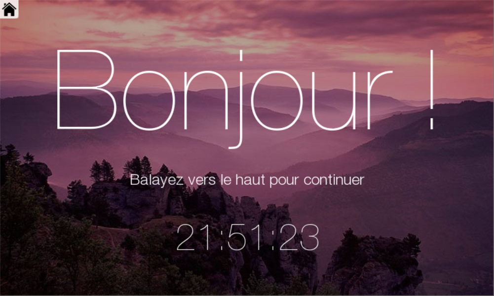
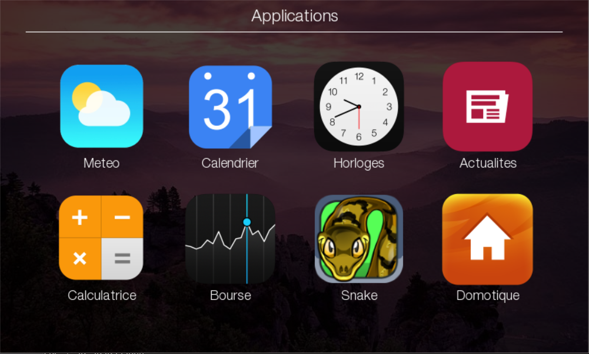

# HomeCenter
Projet ISN : Un système d'exploitation complet et flexible adapté pour une utilisation dans la maison.
Projet libre d'accès et modification pour tous.

__Projet réalisé par Julien REBOUL, Priscille VALLA et Pierre LACLAU au Lycée Jean Jaurès - St Clément de Rivière.__



## Installation
Le système utilise plusieurs librairies utiles pour gérer l'interface, récupérer des informations sur internet et autres.

Outils nécessaires :
  - Python 2.7 à télécharger sur le [site officiel](python.org) de Python.
  - Pygame, à télécharger et installer manuellement [ici](http://pygame.org/download.shtml) (télécharger la première version, "pygame-1.9.1.win32-py2.7.msi").
  - Feedparser, C+et outil permet de récupérer les titres de tout feed RSS (Le Monde, Facebook, Forums...), et nous l'utilisons dans l'application Actualités. A installer avec l'outil **pip** avec la commande : 
```
pip install feedparser
```

  - Google Calendar API, module pris du [site officiel](https://developers.google.com/google-apps/calendar/quickstart/python) de Google Developers. Permet de récupérer tous les agendas et calendriers d'un certain compte, nous l'utilisons dans l'application Calendrier. A installer avec l'outil **pip** avec la commande : 
```
pip install --upgrade google-api-python-client
``` 

  - PYOWM, un module qui permet de récupérer les prévisions météo depuis le site www.openweathermap.com. A installer avec l'outil **pip** avec la commande :
```
pip install pyowm
```

  - Pushbullet, un service qui permet d'envoyer et recevoir des notifications entre plusieurs appareils connectés à un même compte. Nous nous en servons dans l'applications Actualités, où l'utilisateur voit les principaux titres sur notre système et peut ouvrir d'un clic l'article complet sur son portable. A installer avec l'outil **pip** avec la commance :
```
pip install pushbullet.py
```


Voilà, le système est prêt à tourner ! Lancez l'exécution de `MainSC.py`, le fichier central, qui gérera l'exécution de tous les autres fichiers automatiquement.


## Structure du projet



Tout commence dans le fichier `MainSC.py`, qui sert de hub général entre applications, écrans, et messages (tactile, transitions...). Il crée la fenêtre, gère la création/destruction/rafraichissement des bons écrans.
**Pour lancer le système**, lancez ce fichier (qui appelera tous les autres automatiquement).

Les fichiers les plus importants sonts les fichiers `xxxxScreen.py`. Chacun d'eux est une de nos applications. A regarder :
```
StartScreen.py
HomeScreen.py
WeatherScreen.py
CalendarScreen.py
TimeScreen.py
```
Les fichiers `xxxxCollector.py` sont les récupérateurs d'informations sur internet, comme `CalendarCollector.py` pour la récupération d'événements.

Les autres fichiers sont soit des fichiers 'outils' (`Helpers.py`, `AnimationManager.py`, `TestScreen.py`, ), des fichiers faisant partie de la plateforme 'interne' du système (gérer les écrans avec `ScreenRedirector.py`, reconnaitres les gestes tactiles avec `TouchManager.py`, distribuer des messages entre applications avec `InputManager.py`...) ou des composants moins importants comme les fichiers `xxxxWidget.py` (Widgets pas encore construits, seule la structure première y est). 

Les fichiers `.pyc` sont à ignorer, ce ne sont que des fichiers générés automatiquement par python lors du démarrage de l'aplication.

P.S. : Le Projet est encore sous construction, nous avons déjà commenté les zones les plus importantes (normalement), mais c'est très incomplet par rapport à quoi s'attendre pour la version finale.

P.S. : Si vous avez des questions, n'hésitez pas à nous contacter. Bonne consultation :+1: !

Julien REBOUL, Priscille VALLA et Pierre LACLAU, projet ISN au Lycée Jean Jaurès - St Clément de Rivière. 
